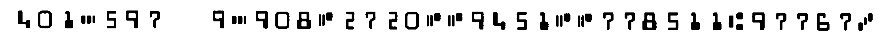
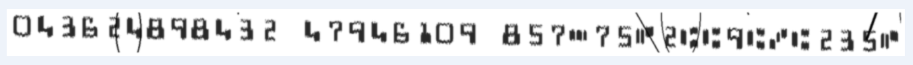
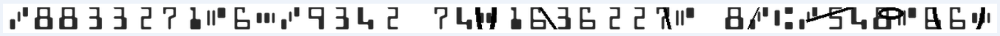
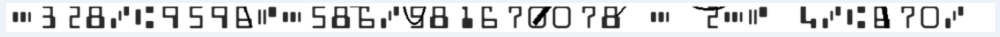

# Tesseract Auto Training

This method of training tesseract uses synthetic data by dynamically generating check images to be used as ground-truth.

The advantages of this method are:

* The ground truth is always correct because we know what we are putting into the image.
* No actual data is required, so there are no security issues with PII.
* We can generate as many checks as we want (within time constraints).

The disadvantages of this method are:

* The synthetically generated images may not accurately simulate real images.

## Steps

1. Install the following:

   * `gmake` (make on ubuntu)

   * `git`

   * `python3`

   * `tesseract` version 5 - see [tesseract installation instructions](https://tesseract-ocr.github.io/tessdoc/Installation.html)

2. Clone https://github.com/tesseract-ocr/tesstrain

3. From within the tesstrain dir, run `gmake tesseract-langdata` to place the language files in the correct location. This only needs to berun the first time.

4. Copy the following files from this directory into your cloned tesstrain directory: `train`, `gen_ground_truth.py`.

5. Start training by running the "train" script e.g. `train 100000`. You may wish to train with a smaller number to ensure everything works correctly from start to finish.

   > NOTE: Look at the `train` and `gen_ground_truth.py` scripts and consider changing various values to tweak and optimize the behavior to your liking..

6. Grab the `micr.trainedata` file from the location where it is created, and test it out!

## Text Recognition Data Generator

As opposed to `text2image` used in the above method, there is another tool `TextRecognitionDataGenerator` that can also be used to generate images from text, and has more distortions at its disposal. A version using this tool has also been created and it outlined below.

### Modified Steps for TRDG

Steps 1-3: *Same as Above*

4. Copy the following files from this directory into your cloned tesstrain directory: `train_trdg.sh`, `gen_ground_truth_trdg.py`. Note you may need to run `chmod +x` on these two scripts to ensure they are executable.

5. Install TextRecognitionDataGenerator following the instructions in its [documentation](https://textrecognitiondatagenerator.readthedocs.io/en/latest/installation.html).

6. Start Training by Running ```./train_trdg.sh <NUM_IMAGES>```

### Explanation of TRDG Options

The `gen_ground_truth_trdg.py` script runs a subprocess with a series of options. The explanation for each is below:

**-c : Count** - Number of images (must be 1 here as we want to run with a different gt file each time)

**-d : Distortion** - Adds a sin or cosine wave to the text when set to 3.

**-k -rk: Skew** - Adds random skew to the text, up to the integer value in degress, in either direction.

**-b : Background** - Changes the image background. 1 is necessary for a white background.

**-bl -rbl : Blur** - Adds random gaussian blur to the image up to the integer value given.

**-f : Height** - Sets the height of the image. 64 was found to give the best value.

**-ft : Font** - Used to find the path to the MICR font.

**-i : Imput File** - Allows the text to be generated from a given ground truth file.

**-obb : Output Boxes** - Generates box files for the images.

**-e : Extension** - Used to set the file extension for the images to `tif`.

**-stw : Stroke Width** - Sets the weight of the font. All values are used evenly.

**-ioutput_dir : Output Directory** - Allows us to set the output directory to where needed for Tesseract.

## Signature Overlap

The following code can be run on the generated images to add random lines accross the MICR text. This was used to help simulate common occurrences where a signature would cross into the MICR line and obscure the characters. This is recommended to create the maximum level of distortion and realism. However, work is still needed on this as these checks did not result in a traineddata file which yielded high accuracy.

```python
def sig_overlap(image: Image) -> Image:
    percentageOfTimeToSigOverlap = int(os.getenv("OVERLAP","0"))
    p = rnd.randint(0, 100)
    if (p > percentageOfTimeToSigOverlap):
        return image
    w, h = image.size
    highestPoint = -h*3
    lowestPoint = h*2
    maxWidth = int(w/16)
    for i in range (3):
        x1 = rnd.uniform(0, w)
        y1 = rnd.uniform(highestPoint, 0)
        x2 = rnd.uniform(x1, x1+maxWidth)
        y2 = rnd.uniform(0, lowestPoint)
        bbox =  (x1, y1, x2, y2)
        lineWidth = rnd.randint(2,7)
        draw = ImageDraw.Draw(image)
        draw.ellipse(bbox, width=lineWidth, outline="black")
    for i in range (4):
        x1 = rnd.uniform(0, w)
        y1 = rnd.uniform(highestPoint, 0)
        x2 = rnd.uniform(x1, x1+maxWidth)
        y2 = rnd.uniform(0, lowestPoint)
        if i % 2 == 0:
            y1,y2 = y2,y1
        bbox =  (x1, y1, x2, y2)
        lineWidth = rnd.randint(2,7)
        draw = ImageDraw.Draw(image)
        draw.line(bbox, width=lineWidth, fill=(0,0,0,256))
    return image
```

## Examples

Example outputs of the synthetic check generation process can be seen below.

### Using text2image



### Using TRDG and sig_overlap





## Results and Recommendations

While the images created by all the methods above visibly resemble real check data extremely closely, the results from the actual training were nowhere near as good as those from training with real checks. This remains puzzling and further investigation into this could be very valuable; if synthetic training could work we could train on far larger data sets with more realistic data without having to find real checks to use.

Specifically, text2image yielded at most an 52% accuracy, while TRDG yielded almost no success. **Further investigation and work from the community could prove extremely valuable in this area and would be highly recommended**.


